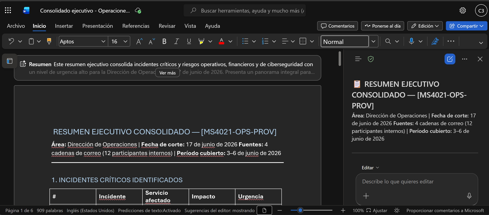

# Demostración 1. Preparar el contexto operativo desde Outlook

## Objetivo de la práctica:
Al finalizar la práctica, serás capaz de:
- Priorizar correos relacionados con incidentes operativos, solicitudes críticas y seguimiento de proveedores.
- Usar Copilot en Outlook para resumir cadenas de correo con foco ejecutivo, identificando incidentes críticos, proveedores involucrados y acciones pendientes.
- Construir un bloque de contexto que alimente el análisis posterior en Excel y Microsoft 365 Copilot Chat.

## Duración aproximada:
- 15 minutos.

## Tabla de ayuda:
| Elemento | Valor de referencia | Observaciones |
| --- | --- | --- |
| Escenario | Evaluación de incidentes, proveedores y servicios críticos | Usar datos ficticios y no información real del banco. |
| Distintivo de correos | `[MS4021-OPS-PROV]` | Permite buscar rápidamente los correos en Outlook. |

## Instrucciones 
<!-- Proporciona pasos detallados sobre cómo configurar y administrar sistemas, implementar soluciones de software, realizar pruebas de seguridad, o cualquier otro escenario práctico relevante para el campo de la tecnología de la información -->

### Tarea 1. Preparar el buzón y localizar los correos operativos.

**Paso 1.** Abrir Outlook con la cuenta corporativa asignada para la demostración.

**Paso 2.** Buscar primero con el distintivo `[MS4021-OPS-PROV]`. De forma complementaria, usar palabras clave como: `incidente`, `proveedor`, `SLA`, `licenciamiento`, `ciberseguridad`, `continuidad`, `RFP`, `operaciones`.

**Paso 3.** Identificar cuatro correos consolidados que representen las siguientes perspectivas:
- Incidentes operativos críticos y continuidad de servicios.
- Seguimiento de proveedores, licenciamiento y SLA.
- Alertas de ciberseguridad y continuidad operativa.
- Evaluación RFP y optimización presupuestal.

**Paso 4.** Marcar con bandera los correos que requieren seguimiento ejecutivo inmediato, especialmente incidentes críticos y evaluación de proveedores.

---

### Tarea 2. Usar Copilot en Outlook para resumir y priorizar los correos.

**Paso 1.** Abrir el correo relacionado con incidentes operativos críticos.

**Paso 2.** Seleccionar Copilot en Outlook y solicitar un resumen ejecutivo del hilo.

Prompt sugerido:

```text
Resume esta cadena de correos desde una perspectiva ejecutiva para el área de Operaciones de un banco. Identifica:
1. Tema principal.
2. Incidentes o solicitudes críticas mencionadas.
3. Proveedores, servicios o contratos involucrados.
4. Riesgos operativos, financieros, de ciberseguridad o continuidad.
5. Acciones pendientes y responsables sugeridos.
6. Información que debe analizarse en Excel o Copilot Chat.
7. Nivel de urgencia: alto, medio o bajo.
```

**Paso 3.** Repetir el análisis con los otros tres correos consolidados.

**Paso 4.** Solicitar a Copilot que consolide los cuatro resúmenes en un solo bloque ejecutivo.

Prompt sugerido:

```text
Consolida los resúmenes de los cuatro correos en un solo bloque ejecutivo. Prioriza la información según urgencia e impacto para Operaciones.

Organiza el resultado con esta estructura:
1. Incidentes críticos identificados.
2. Proveedores y servicios involucrados.
3. Riesgos operativos, financieros, de continuidad y ciberseguridad.
4. Solicitudes o decisiones pendientes.
5. Acciones recomendadas para continuar el análisis en Excel y Copilot Chat.
```

**Paso 5.** Exportar el consolidado a Word `Consolidado ejecutivo - Operaciones y proveedores`.

>[!Nota]
> Explicar a los participantes que este primer resultado no es el entregable final. Es el contexto que permitirá cruzar información de correos con datos de incidentes, proveedores, costos y RFP.

### Resultado esperado
Al finalizar, el instructor debe contar con un consolidado ejecutivo donde se identifiquen incidentes críticos, proveedores involucrados, riesgos de continuidad, necesidades de optimización y decisiones pendientes para el análisis operativo posterior.

