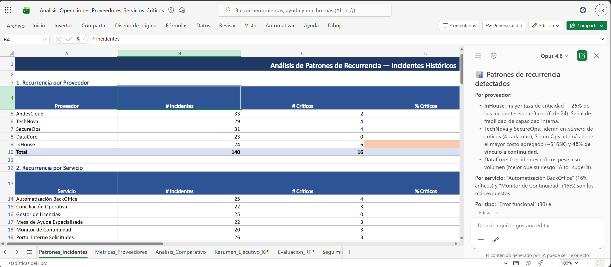
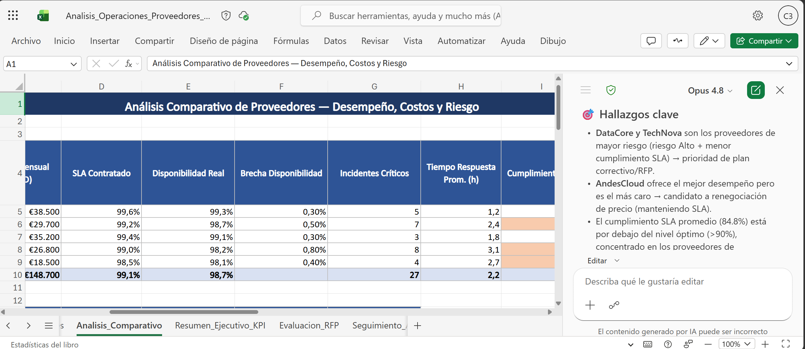
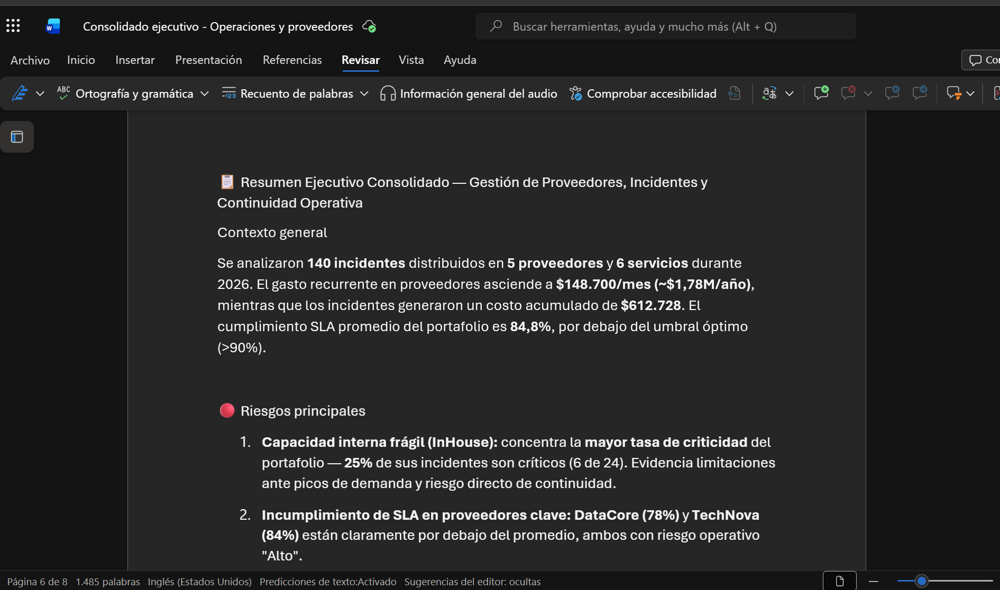

# Demostración 2. Analizar información operativa y financiera con Copilot en Excel

## Objetivo de la práctica:
Al finalizar la práctica, serás capaz de:
- Usar Copilot en Excel para identificar patrones de incidentes, recurrencias, criticidad y variaciones operativas.
- Comparar desempeño, costos y cumplimiento de SLA entre proveedores de servicios críticos.
- Generar hallazgos ejecutivos que sirvan como base para la evaluación estratégica y recomendaciones posteriores.

## Duración aproximada:
- 20 minutos.

## Tabla de ayuda:
| Elemento | Valor de referencia | Observaciones |
| --- | --- | --- |
| Curso | Custom MS-4021.10 BC (Priv) | Experiencia de inmersión para Operaciones. |
| Escenario | Evaluación de incidentes, proveedores y servicios críticos | Usar datos ficticios y no información real del banco. |
| Distintivo de correos | `[MS4021-OPS-PROV]` | Permite buscar rápidamente los correos en Outlook. |
| Archivo base | `Analisis_Operaciones_Proveedores_Servicios_Criticos.xlsx` | Debe estar guardado en OneDrive o SharePoint. |

## Instrucciones 
<!-- Proporciona pasos detallados sobre cómo configurar y administrar sistemas, implementar soluciones de software, realizar pruebas de seguridad, o cualquier otro escenario práctico relevante para el campo de la tecnología de la información -->

### Tarea 1. Abrir el archivo operativo y revisar la estructura.

**Paso 1.** Abrir Excel en el navegador o en la aplicación de escritorio.

**Paso 2.** Abrir el archivo `Analisis_Operaciones_Proveedores_Servicios_Criticos.xlsx` desde OneDrive o SharePoint.

**Paso 3.** Revisar las hojas `Incidentes_Historicos`, `Metricas_Proveedores`, `Evaluacion_RFP`, `Seguimiento_Acciones`, `Guia_Copilot` y `Resumen_Ejecutivo`.

**Paso 4.** Activar Copilot en Excel desde la cinta de opciones.

>[!Nota]
> Explicar que los datos son ficticios y sirven para simular análisis de incidentes, proveedores, costos, SLA y continuidad operativa.

---

### Tarea 2. Identificar patrones y recurrencias de incidentes.

**Paso 1.** Solicitar a Copilot un análisis de recurrencias por servicio, proveedor y criticidad.

```text
Analiza la hoja Incidentes_Historicos e identifica patrones de recurrencia por servicio, proveedor, tipo de incidente, criticidad y causa preliminar. Presenta el resultado en una tabla ejecutiva con recomendaciones iniciales.
```

**Paso 2.** Pedir a Copilot que clasifique incidentes por criticidad, urgencia e impacto operativo.

```text
Clasifica los incidentes por criticidad, urgencia e impacto operativo. Identifica los 5 incidentes que requieren atención prioritaria y explica por qué deberían escalarse a liderazgo de Operaciones.
```

**Paso 3.** Solicitar una explicación en lenguaje natural para un público directivo.

```text
Explica en lenguaje natural las principales variaciones encontradas en los incidentes. Resume qué servicios, proveedores y causas preliminares concentran mayor riesgo operativo o de continuidad.
```

---

### Tarea 3. Comparar desempeño y costos entre proveedores.

**Paso 1.** Abrir la hoja `Metricas_Proveedores`.

**Paso 2.** Solicitar a Copilot una comparación entre proveedores.

```text
Compara desempeño y costos entre proveedores usando la hoja Metricas_Proveedores. Incluye costo mensual, disponibilidad real, incidentes críticos, tiempo promedio de respuesta, cumplimiento de SLA y riesgo operativo. Recomienda qué proveedores requieren renegociación, plan correctivo o evaluación RFP.
```

**Paso 3.** Identificar oportunidades de optimización presupuestal.

```text
Identifica oportunidades de optimización presupuestal sin comprometer continuidad operativa ni ciberseguridad. Presenta recomendaciones con impacto esperado, riesgo de implementación y área responsable.
```

**Paso 4.** Solicitar un tablero o resumen ejecutivo en una hoja nueva.

```text
Crea un resumen ejecutivo en una hoja nueva con indicadores clave: incidentes totales, incidentes críticos, costo total estimado, proveedores con mayor riesgo, cumplimiento de SLA y acciones prioritarias. Usa tablas y gráficos cuando sea útil.
```



---

### Tarea 4. Consolidar los hallazgos para Copilot Chat.

**Paso 1.** Solicitar a Copilot que consolide los hallazgos operativos y financieros.

```text
Consolida en el chat los hallazgos del análisis de incidentes, proveedores, costos, SLA y continuidad operativa en un bloque de texto ejecutivo. Incluye riesgos principales, oportunidades de mejora, proveedores prioritarios y preguntas que deben resolverse en Copilot Chat.
```

**Paso 2.** Copiar los hallazgos al documento temporal que contiene el consolidado de Outlook.

>[!Nota]
> Explicar que estos hallazgos serán usados en la siguiente demostración para comparar propuestas de proveedores, analizar RFP, generar hipótesis de causa raíz y proponer mitigaciones.

### Resultado esperado
Al finalizar, el instructor debe contar con un análisis estructurado de incidentes, proveedores, costos, SLA, riesgos y oportunidades de optimización para alimentar la evaluación estratégica en Microsoft 365 Copilot Chat.

