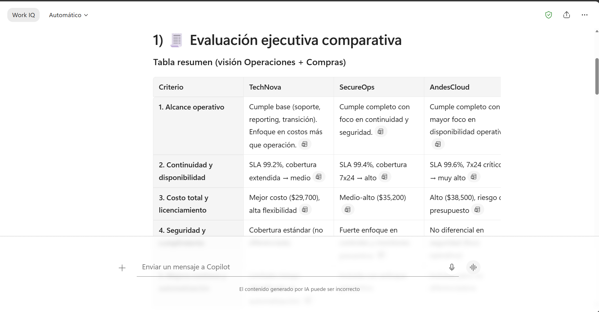
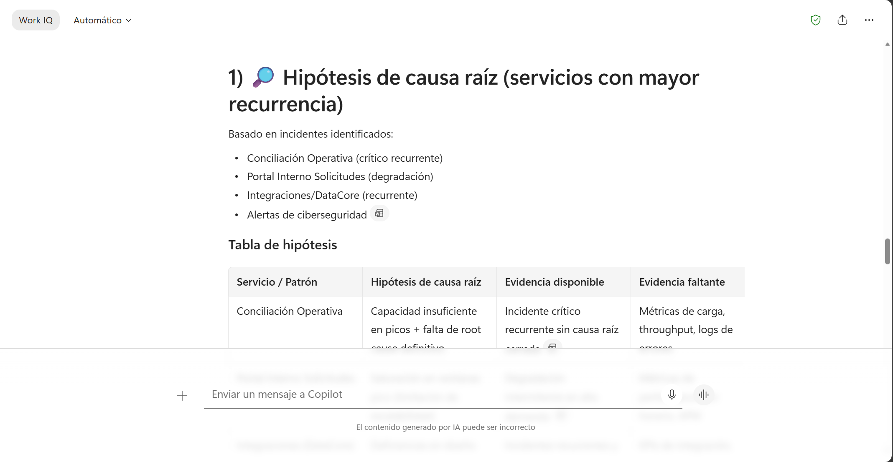
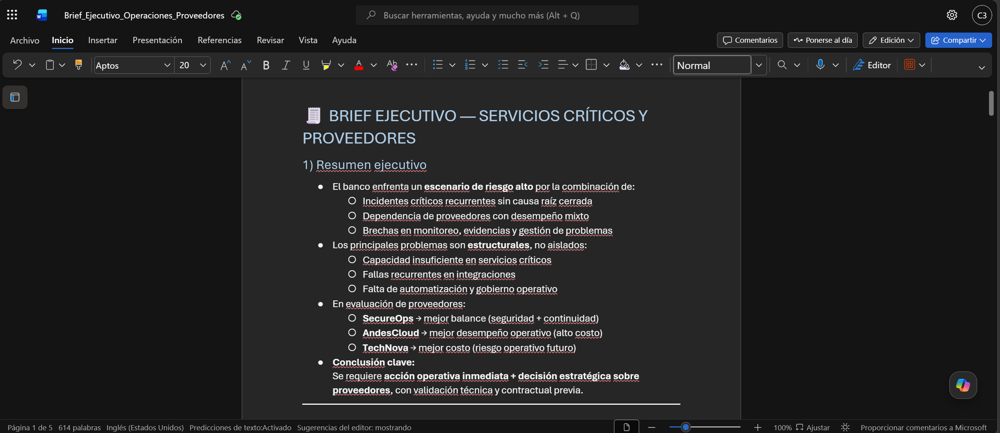

# Demostración 3. Evaluar proveedores, escenarios operativos y acciones de mitigación con Microsoft 365 Copilot Chat

## Objetivo de la práctica:
Al finalizar la práctica, serás capaz de:
- Usar Microsoft 365 Copilot Chat para comparar propuestas de proveedores contra un RFP base y una rúbrica definida.
- Generar hipótesis de causa raíz para incidentes recurrentes y recomendaciones de mitigación.
- Preparar un brief ejecutivo con decisiones operativas, riesgos, dependencias y métricas de seguimiento.

## Duración aproximada:
- 20 minutos.

## Tabla de ayuda:
| Elemento | Valor de referencia | Observaciones |
| --- | --- | --- |
| Curso | Custom MS-4021.10 BC (Priv) | Experiencia de inmersión para Operaciones. |
| Escenario | Evaluación de incidentes, proveedores y servicios críticos | Usar datos ficticios y no información real del banco. |
| Archivo base | `Analisis_Operaciones_Proveedores_Servicios_Criticos.xlsx` | Debe estar guardado en OneDrive o SharePoint. |
| Documento base | `RFP_Base_Servicios_Criticos_Banco.docx` | RFP ficticio para evaluar proveedores. |
| Propuestas | `Propuesta_Proveedor_AndesCloud.docx`, `Propuesta_Proveedor_TechNova.docx`, `Propuesta_Proveedor_SecureOps.docx` | Documentos ficticios para comparación. |

## Instrucciones 
<!-- Proporciona pasos detallados sobre cómo configurar y administrar sistemas, implementar soluciones de software, realizar pruebas de seguridad, o cualquier otro escenario práctico relevante para el campo de la tecnología de la información -->

### Tarea 1. Preparar los insumos en Microsoft 365 Copilot Chat.

**Paso 1.** Abrir Microsoft 365 Copilot Chat desde `https://m365.cloud.microsoft.com/`.

**Paso 2.** Crear un nuevo chat y adjuntar o referenciar los siguientes insumos:
- Consolidado ejecutivo generado desde Outlook.
- `RFP_Base_Servicios_Criticos_Banco.docx`.
- Propuestas de AndesCloud, TechNova y SecureOps.
- `Procedimiento_Continuidad_Operativa_Demo.docx`.

---

### Tarea 2. Comparar propuestas de proveedores contra el RFP.

**Paso 1.** Solicitar a Copilot una comparación ejecutiva de proveedores.

Prompt sugerido:

```text
Actúa como asesor de Operaciones y Compras para un banco. Compara las propuestas de AndesCloud, TechNova y SecureOps contra el RFP base de servicios críticos.

Necesito que evalúes:
1. Cumplimiento del alcance operativo.
2. Continuidad y disponibilidad.
3. Costo total y licenciamiento.
4. Seguridad y cumplimiento.
5. Mejora continua y automatización.
6. Riesgos y dependencias de cada proveedor.
7. Recomendación preliminar para liderazgo.

Presenta el resultado en una tabla ejecutiva.
```

**Paso 2.** Solicitar una evaluación ponderada con la rúbrica del RFP.

```text
Usa la rúbrica del RFP para generar una evaluación ponderada de los proveedores. Incluye criterio, peso, calificación sugerida por proveedor, justificación breve y recomendación final. Indica claramente qué supuestos estás haciendo y qué información debe validarse antes de decidir.
```



---

### Tarea 3. Generar hipótesis de causa raíz y acciones de mitigación.

**Paso 1.** Solicitar a Copilot un análisis de causa raíz.

```text
Con base en los incidentes recurrentes y hallazgos operativos, genera hipótesis de causa raíz para los servicios con mayor recurrencia. Para cada hipótesis, incluye evidencia disponible, evidencia faltante, impacto, acción de mitigación, responsable sugerido y prioridad.
```

**Paso 2.** Solicitar recomendaciones para incidentes críticos.

```text
Propón acciones de mitigación para los incidentes críticos identificados. Clasifica las acciones en inmediatas, preventivas y estructurales. Incluye responsable, dependencia, métrica de éxito y riesgo de no actuar.
```

**Paso 3.** Consultar el procedimiento de continuidad operativa.

```text
Usando el procedimiento de continuidad operativa adjunto, valida si las acciones propuestas cumplen con los criterios de criticidad, escalamiento y evidencias requeridas. Señala brechas y ajustes necesarios.
```



---

### Tarea 4. Preparar el brief ejecutivo para PowerPoint.

**Paso 1.** Solicitar a Copilot que genere un brief ejecutivo listo para presentación.

```text
Organiza todo el análisis en un brief ejecutivo para líderes de Operaciones, Ciberseguridad y Dirección. Incluye:
1. Resumen ejecutivo.
2. Incidentes y patrones principales.
3. Proveedores evaluados y recomendación preliminar.
4. Riesgos operativos, financieros, de continuidad y ciberseguridad.
5. Acciones de mitigación priorizadas.
6. Métricas de seguimiento.
7. Decisiones solicitadas a liderazgo.
8. Próximos pasos.
```

**Paso 2.** Exportar el resultado en un documento Word con el nombre `Brief_Ejecutivo_Operaciones_Proveedores`.

>[!Nota]
> Validar que Copilot no agregue cifras, compromisos contractuales o conclusiones no sustentadas por los documentos y datos del ejercicio.

### Resultado esperado
Al finalizar, el instructor debe contar con un brief ejecutivo que integre comparación de proveedores, análisis de causa raíz, riesgos, mitigaciones, métricas y decisiones requeridas para el comité operativo.

