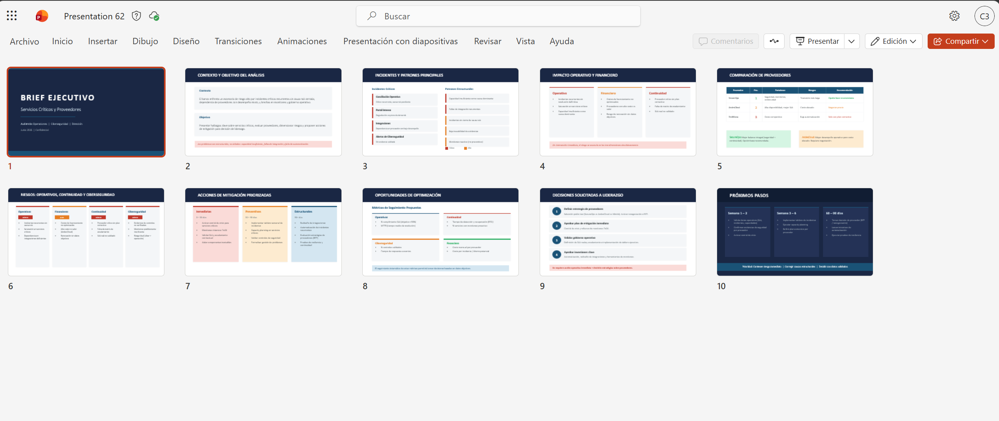
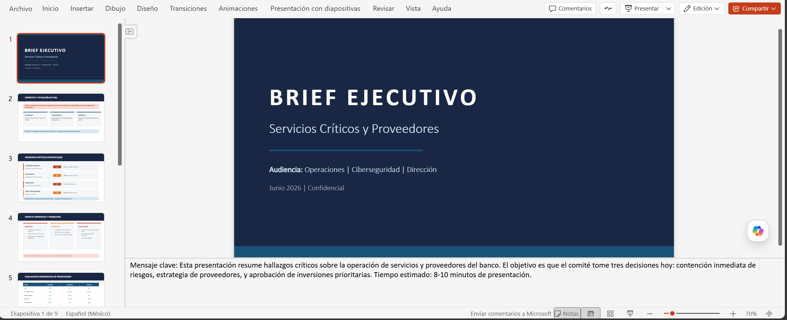
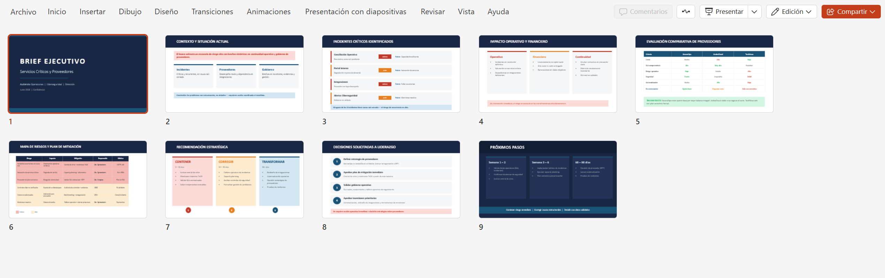

# Demostración 4. Crear una presentación ejecutiva de hallazgos operativos con Copilot en PowerPoint

## Objetivo de la práctica:
Al finalizar la práctica, serás capaz de:
- Crear una presentación ejecutiva con Copilot en PowerPoint a partir del brief generado en las demostraciones anteriores.
- Refinar diapositivas relacionadas con incidentes, proveedores, riesgos, optimización y acciones de mitigación.
- Comunicar recomendaciones estratégicas para líderes de Operaciones, Ciberseguridad y áreas directivas.

## Duración aproximada:
- 20 minutos.

## Tabla de ayuda:
| Elemento | Valor de referencia | Observaciones |
| --- | --- | --- |
| Curso | Custom MS-4021.10 BC (Priv) | Experiencia de inmersión para Operaciones. |
| Escenario | Evaluación de incidentes, proveedores y servicios críticos | Usar datos ficticios y no información real del banco. |
| Archivo base | `Analisis_Operaciones_Proveedores_Servicios_Criticos.xlsx` | Debe estar guardado en OneDrive o SharePoint. |

## Instrucciones 
<!-- Proporciona pasos detallados sobre cómo configurar y administrar sistemas, implementar soluciones de software, realizar pruebas de seguridad, o cualquier otro escenario práctico relevante para el campo de la tecnología de la información -->

### Tarea 1. Preparar el insumo para PowerPoint.

**Paso 1.** Confirmar que el brief ejecutivo generado en la Demostración 3 esté guardado en OneDrive o SharePoint.

**Paso 2.** Si el brief no está disponible, usar el documento de respaldo `Brief_Ejecutivo_Operaciones_Fallback.docx`.

**Paso 3.** Verificar que el documento incluya incidentes, patrones, proveedores evaluados, riesgos, mitigaciones, métricas y decisiones solicitadas.

---

### Tarea 2. Crear la presentación desde Copilot en PowerPoint.

**Paso 1.** Abrir PowerPoint en el navegador o en la aplicación de escritorio.

**Paso 2.** Crear una presentación en blanco y abrir el panel de Copilot.

**Paso 3.** Seleccionar la opción para adjuntar y selecciona `Biref_Ejecutivo_Operaciones_Proveedores.docx` (creado en la demostración 3)

Prompt sugerido:

```text
Crea una presentación ejecutiva de 10 diapositivas a partir del documento adjunto. La audiencia son líderes de Operaciones, Ciberseguridad y Dirección.

La presentación debe incluir:
1. Portada ejecutiva.
2. Contexto y objetivo del análisis.
3. Incidentes y patrones principales.
4. Impacto operativo y financiero.
5. Comparación de proveedores.
6. Riesgos operativos, de continuidad y ciberseguridad.
7. Acciones de mitigación priorizadas.
8. Oportunidades de optimización.
9. Decisiones solicitadas a liderazgo.
10. Próximos pasos.

Usa lenguaje ejecutivo, mensajes breves y enfoque visual.
```
**Paso 4.** Esperar a que Copilot genere el primer borrador y revisar la estructura propuesta.



---

### Tarea 3. Refinar tono, narrativa y formato.

**Paso 1.** Solicitar a Copilot que reorganice la narrativa para toma de decisiones.

```text
Reorganiza la presentación para que cuente una historia ejecutiva clara: contexto, incidentes, impacto, proveedores, riesgos, recomendación, decisión requerida y próximos pasos. Mantén máximo una idea principal por diapositiva.
```

**Paso 2.** Pedir una diapositiva visual de riesgos y mitigaciones.

```text
Convierte la sección de riesgos y mitigaciones en una diapositiva visual. Incluye riesgo, impacto, mitigación, responsable y métrica de seguimiento.
```

**Paso 3.** Refinar la diapositiva de proveedores.

```text
Mejora la diapositiva de comparación de proveedores para que muestre costo, SLA, riesgo operativo, seguridad y recomendación preliminar. Usa formato ejecutivo y evita exceso de texto.
```

**Paso 4.** Solicitar notas del presentador.

```text
Genera notas del presentador para cada diapositiva. Las notas deben ayudar al instructor a explicar el mensaje clave en menos de un minuto por diapositiva, con tono ejecutivo y orientado a decisiones.
```

**Paso 5.** Guarda el documento con el nombre `Presentacion_Ejecutiva_Operaciones_Proveedores`.




### Resultado esperado
Al finalizar, el instructor debe contar con una presentación ejecutiva que comunique hallazgos operativos, patrones de incidentes, evaluación de proveedores, riesgos y recomendaciones estratégicas para continuidad y mejora operativa.

